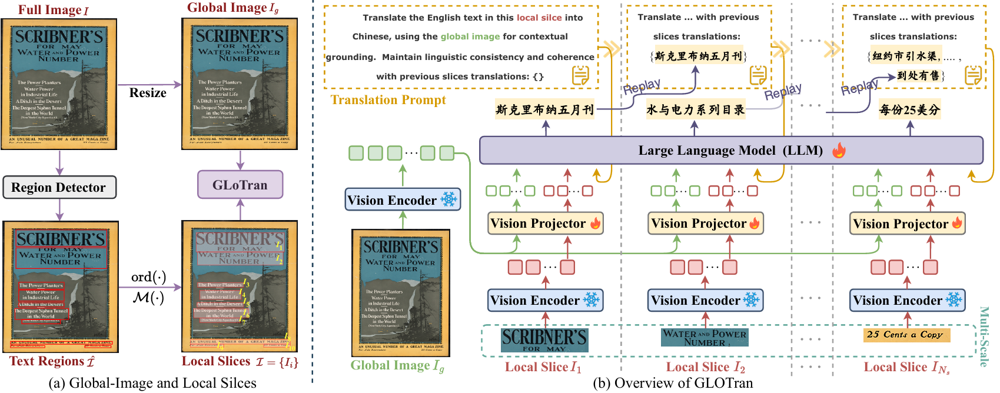

# GLoTran

**Global-Local Dual Perception for MLLMs in High-Resolution Text-Rich Image Translation**
<p align="center">  </p>
This repository is currently under preparation. The source code, dataset processing scripts, model configurations, evaluation protocols, and related resources will be released after internal organization, verification, and documentation are completed.

## Citation

If you find this project useful for your research, please consider citing our work:

```bibtex
@misc{lu2026globallocaldualperceptionmllms,
  title         = {Global-Local Dual Perception for MLLMs in High-Resolution Text-Rich Image Translation},
  author        = {Junxin Lu and Tengfei Song and Zhanglin Wu and Pengfei Li and Xiaowei Liang and Hui Yang and Kun Chen and Ning Xie and Yunfei Lu and Jing Zhao and Shiliang Sun and Daimeng Wei},
  year          = {2026},
  eprint        = {2602.21956},
  archivePrefix = {arXiv},
  primaryClass  = {cs.CV},
  url           = {https://arxiv.org/abs/2602.21956}
}
```

The final citation information will be updated after publication.

## Contact

For questions or discussions, please contact:

**Junxin Lu**: [junxinlu.ecnu@gmail.com](mailto:junxinlu.ecnu@gmail.com)

Further details will be updated as the project becomes publicly available.
